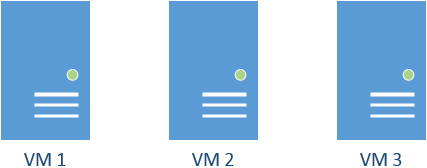
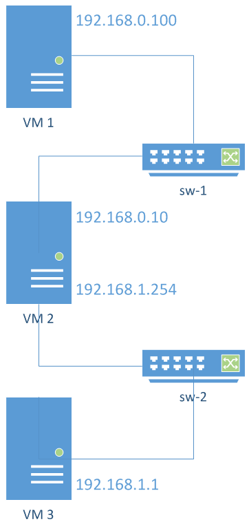
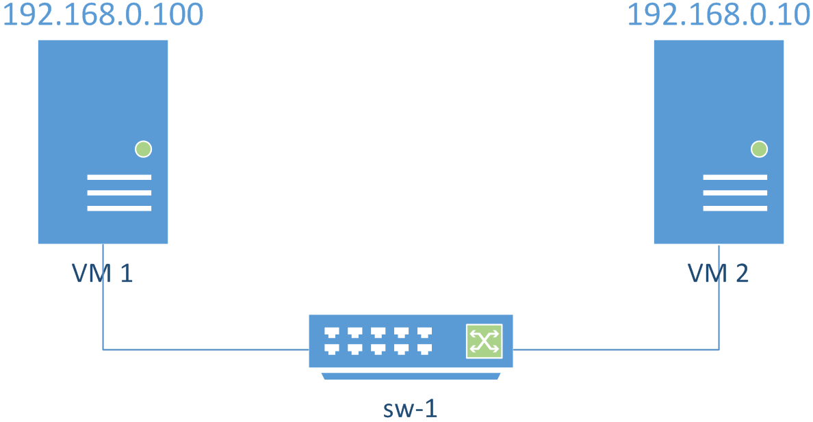
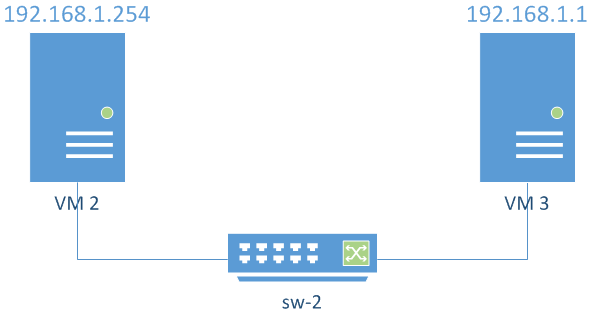

Instituto Superior Técnico, Universidade de Lisboa

**Network and Computer Security**

# Lab guide: Implementation and Analysis of a Virtual Computer Network

## Goals

- Implement and test a virtual computer network.
- Perform a simple TCP/IP packet analysis.

## 1. UTM and QEMU

The setup of the machines for this lab depends on the usage of UTM, a software that leverages QEMU under the hood to perform virtualization. 
Add here instructions to install and better explanation on the topic as well as awareness and references and promiscuous mode 

## 1.1 Setup the lab for UTM

To setup our lab environment to be used with VirtualBox, you need to have 3 instances of your VMs. You can follow the instructions in [here](https://github.com/tecnico-sec/Setup) to install 2 new machines from scratch, or you can clone the one you have been using so far.



*Figure 1. In this laboratory assignment, you will need to create three virtual machines, which will be used to explore communication inside virtual networks and to test packet forwarding.*

## 1.1.1 Create the virtual networks and machines (UTM)

If you decide to clone the existing machine you should

- Right-Click on top of the machine name `VM1` and click `Clone`
- Right-Click the machine once again, select `Edit` and edit the name you want to give to the new machine

Repeat this process twice and lets call the original machine VM1, and the new ones VM2 and VM3.

The intended topology of our network is shown in Figure 2 with VM2 also connected to the Internet (with an IP address that is obtained via DHCP).



*Figure 2. Intended network layout. 
VM1 and VM2 are connected in a virtual network via sw-1. 
VM2 and VM3 are connected in another virtual network via sw-2. 
VM2 will operate as a gateway between the two subnets, and as a gateway to the Internet.*

The easier way to connect the VM1 and VM2 in the same network is to do the following in the UTM interface with the VM turned off:

- Edit the VM, go to `QEMU` section and scroll down until the last text box with the label `New...`. 
- Go to `https://miniwebtool.com/mac-address-generator/`, click Generate MAC Address and copy the generated MAC.
- Add the following option: `-device` and press `Enter` at the end:
- A new line will appear. Add the following option: `virtio-net-pci,mac=<GENERATED MAC>,netdev=sw1` where `<GENERATED MAC>` is the MAC address generated in the previous step.
- Add the folling option: `-netdev`.
- Add the folling option: `vmnet-macos,mode=host,id=sw1`.


Repeat for VM2 and for VM3. Also, create a second Network adapter in VM2 by repeating the same procedure and replacing the `sw1` for `sw2` in both VM2(second adapter) and VM3. Please note that you should always generate a new MAC Address for each adapter. 
Finally, create a third Network adapter in VM2 that is `nat`-ed with your physical address. You can do this by going to `Network` tab, select `Shared Network` and press `save`.
This interface will be used to access the Internet.

Proceed now to 2.


## 2. Configure the machines to use the virtual networks

We will now configure the machines to the virtual network that connects VM1 to VM2 and the one that connects VM2 and VM3.

### 2.1 Configure the virtual network for VM1 and VM2

We will now configure the IP network (supported by virtual switch sw-1) with static IP addresses. 
VM1 and VM2 will talk using a subnet. 
We will use the private IP addresses 192.168.0.0/24 (meaning that the subnet mask is 255.255.255.0 ¿ we can have 254 addresses to use (from 192.168.0.1 to 192.168.0.254). 
Note that 192.168.0.255 is reserved for broadcast).
Figure 3 presents and overview of the desired configuration. 
The IP address of VM1 will be 192.168.0.100 and VM2 will be 192.168.0.10. 
The values ending with 100 and 10 are arbitrary, they could be any (different) value between 1 and 254.



*Figure 3 Expected layout of the subnet in which VM1 and VM2 will communicate using sw-1.*

Follow the configuration procedure below for both VM1 and VM2.

We are assuming that VM1 has an interface `enp0s3`(connected to sw-1) and VM2 has interfaces `enp0s3` (connected to sw-1), `enp0s8` (connected to sw-2), and `enp0s9` (connected to the internet). 
These `en...` values are the network interface names and are automatically assigned by the operating system following a [device naming convention](https://www.freedesktop.org/wiki/Software/systemd/PredictableNetworkInterfaceNames/).

_How do you know which interface is connected to sw-1 and which one is connected to sw-2? 
Look at their MAC Addresses. 
Running `ip a` shows the MAC address of each interface and you can compare with those of VirtualBox._

First, assign an IP address to VM1 on interface enp0s3.

```bash
$ sudo ifconfig enp0s3 192.168.0.100/24 up
```

And do the same for VM2 (again, note that the interface name may be different)

```bash
$ sudo ifconfig enp0s3 192.168.0.10/24 up
```

Now running `ifconfig` on the VMs should show the respective assigned IP addresses on interface enp0s3. 
If not, try to reload the network interfaces of both VM1 and VM2:

```bash
$ sudo /etc/init.d/networking force-reload
```

To check that the configuration is correct:

```bash
$ /sbin/ifconfig
$ /sbin/route
```

VM2 should now be able to ping VM1:

```bash
$ ping 192.168.0.100
```

And VM1 should be able to ping VM2:

```bash
$ ping 192.168.0.10
```

### 2.2 Configure the virtual network for VM2 and VM3

We will now configure the IP network (supported by virtual switch sw-2) with static IP addresses.
VM2 and VM3 will talk using another subnet. 
We will use the private IP addresses 192.168.1.0/24.
Figure 4 presents the intended configuration. 
The IP address of VM2 will be 192.168.1.254 and the address of VM3 will be 192.168.1.1. 
Again, 254 and 1 are arbitrary values between 1 and 254.



*Figure 4 Expected layout of the subnet in which VM2 and VM3 will communicate using sw-2.*

In VM3, assign the IP address 192.168.1.1 to interface enp0s3.
In VM2 assign the IP address 192.168.1.254 to interface enp0s8 (recall that interface enp0s3 of VM2 is connected to sw-1 and interface enp0s8 of VM2 is connected to sw-2).
The command `ifconfig` should define default routes for those networks. 
You can check it with command `route`.
To finish creating this network, reload the network interfaces of both VM2 and VM3:

```bash
$ sudo /etc/init.d/networking force-reload
```

To check that the configuration is correct:

```bash
$ /sbin/ifconfig
$ /sbin/route
```

VM2 should now be able to ping VM3:

```bash
$ ping 192.168.1.1
```

VM3 should now be able to ping VM2:

```bash
$ ping 192.168.1.254
```

Try to ping VM3 from VM1:

```bash
$ ping 192.168.1.1
```

It should return `Network is unreachable` because VM1 doesn¿t know where to send the packets addressed at network 192.168.1.X.

### 2.3 Configure VM2 as gateway

Defining a _default gateway_ means that whenever a machine does not have a specific route for a given network, those packets are sent to its default gateway.
Since VM2 will be the default gateway for VM1, IP forwarding must be enabled in VM2. 
This will allow VM1 to communicate with machines outside its subnet 192.168.0.X.

Activate IP forwarding with:

```bash
$ sudo sysctl net.ipv4.ip_forward=1   # on VM2
```

Confirm that the flag value was updated to 1:

```bash
$ /sbin/sysctl net.ipv4.conf.all.forwarding
```

Now set VM2 as the default gateway for VM1 by doing this:

```bash
$ sudo ip route add default via 192.168.0.10   # on VM1
```

Try again to ping VM3 from VM1.

```bash
$ ping 192.168.1.1       # on VM1
```

Does it work? 
Can you identify where the problem is? 
Run the commands below and see if you understand what is happening

```bash
$ sudo tcpdump -i enp0s3   # on VM1
$ sudo tcpdump -i enp0s3   # on VM2
$ sudo tcpdump -i enp0s8   # on VM2
$ sudo tcpdump -i enp0s8   # on VM3
```

What happens now when you ping VM1 from VM3? Why is the answer different?

Add now VM2 also as the default gateway for VM3. 
This would allow VM3 to talk to machines outside its subnet 192.168.1.X.

```bash
$ sudo ip route add default via 192.168.1.254    # on VM3
```

- Can you now ping VM3 from VM1? Why? 
- And can you ping VM1 from VM3? Why?

### 2.4 Configure NAT (Network Address Translation)

Try to ping google.com from the 3 machines? Why can't you do it from VM1 nor VM3? 

The issue is that VM2 is acting as the gateway to the internet for both VM1 and VM3 but is not NATing the packets. 
If you run

```bash
$ ping 8.8.8.8                    # on VM1
$ sudo tcpdump -i enp0s9 -p icmp    # on VM2 (interface to the internet)
```

you can observe that the packets go out to google.com but do not come back. 
Why? 
Because google.com does not know where 192.168.0.100 is and so cannot send the packets back.
You can use the iptables command (man iptables) in VM2 to correct this behaviour. 
NAT will do the source and destination mapping.

```bash
$ sudo iptables -P FORWARD ACCEPT    # Defines default policy for FORWARD
$ sudo iptables -F FORWARD           # Flushes all the rules from chain FORWARD
$ sudo iptables -t nat -F            # Flushes all the rules from table NAT
$ sudo iptables -t nat -A POSTROUTING  -o enp0s9 -j MASQUERADE    # Creates a source NAT on interface enp0s9
```

Test again

```bash
$ ping 8.8.8.8                    # on VM1
$ sudo tcpdump -i enp0s9 -p icmp    # on VM2 (interface to the internet)
```

- What do you observe? Why does it work now? 
- What is the source address of the packet now? Compare this source address to the previous case.

Lets now go back to 2.3 to the scenario where VM2 is the default gateway for VM1 but where __VM3 has no default gateway__. 

To remove the default gateway run in VM3

```bash
$ sudo route del default    # on VM3
```

- As seen before you cannot ping VM3 from VM1. Could you solve this issue with a NAT (in interface enp0s8 of VM2) instead of adding VM2 as the default gateway for VM3? Why?
- And can you ping VM1 from VM3? Why?

## 3. Monitor network traffic

To monitor the network traffic, we may use VM2 (or another machine, e.g. a VM4, also connected to the network) to run tcpdump and capture all network traffic. 
Make sure you can detect ICMP packets originating at VM3 and with destination VM1 (using ping). Use tcpdump with options -X and -XX and identify the IP addresses, MAC addresses and protocol in a given packet.
While still running /usr/sbin/tcpdump, open a telnet connection between VM1 and VM2 using user `seed` and password `dees`. 
Verify that you can capture both the username and password with tcpdump.

**You have successfully eavesdropped communications¿ But what is the difference between executing telnet from VM1 to VM3 with and without NAT (in interface enp0s8 of VM2)? Use tcpdump to analyse the output and compare the differences.**

You might want to run

```bash
$ sudo tcpdump -i enp0s3   # on VM1
$ sudo tcpdump -i enp0s3   # on VM2
$ sudo tcpdump -i enp0s8   # on VM2
$ sudo tcpdump -i enp0s8   # on VM3
```

## 4. Making these changes permanent

The changes you made before will be lost once you perform a reboot of your machine. 
In order to make them permanent you have to edit the corresponding `/etc/network/interfaces`

```
## On VM1
auto enp0s3
iface enp0s3 inet static
    address 192.168.0.100
    netmask 255.255.255.0
    gateway 192.168.0.10
    dns-nameservers 8.8.8.8 8.8.4.4
```

```
### On VM2
auto enp0s3
iface enp0s3 inet static
    address 192.168.0.10
    netmask 255.255.255.0
    dns-nameservers 8.8.8.8 8.8.4.4

auto enp0s8
iface enp0s8 inet static
    address 192.168.1.254
    netmask 255.255.255.0
    dns-nameservers 8.8.8.8 8.8.4.4

auto enp0s9
iface enp0s9 inet dhcp
```

```
### On VM3
auto enp0s3
iface enp0s3 inet static
    address 192.168.1.1
    netmask 255.255.255.0
    gateway 192.168.1.254
    dns-nameservers 8.8.8.8 8.8.4.4
```

You should also enable IP forwarding permanently on VM2. For that you need to edit `/etc/sysctl.conf` and uncomment the following line

```bash
net.ipv4.ip_forward=1
```

## 5. Gracefully turn off the virtual machines (for rnl-virt only)

To gracefully close the virtual machines which you deployed using the rnl-virt command, execute the following on VM1, VM2 and VM3:

```bash
$ sudo /sbin/poweroff
```

Now, on the host RNL machine, the above command should be enough for the machines to power off and their rnl-virt windows to close automatically. If so, we are done!
If they do not, we must ask to stop the running virtual machine instances launched during this assignment. 
It may occur that after running these commands, the system will say the machines were already stopped (due to executing the command above). 
Ask rnl-virt to close the virtual machines anyway (if the virtual machines have been shut down, use the -f flag for the commands below):

```bash
$ rnl-virt vm stop VM1
$ rnl-virt vm stop VM2
$ rnl-virt vm stop VM3
```

After all the virtual machines have stopped, if their windows are still open on the host system (RNL computer) you may close their respective windows by pressing the X button on the top-right corner of the window.

__You may now want to copy the files from /var/tmp to your home folder. You are going to need them for the next lab.__

**Acknowledgments**

Adapted by: Nuno Sabino

Revised by: Pedro Adão, Miguel Pardal
